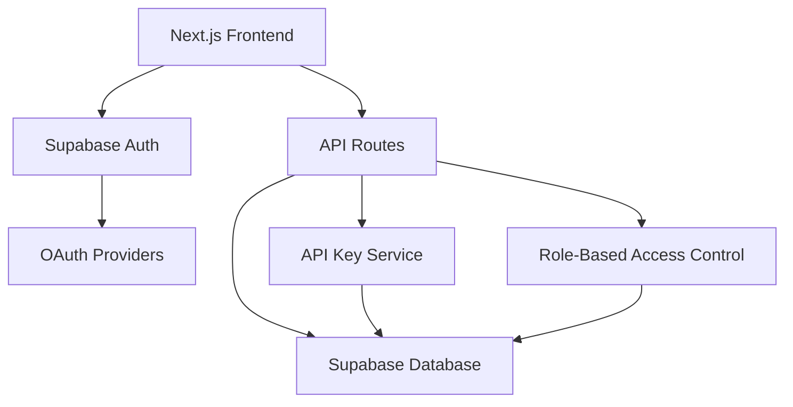
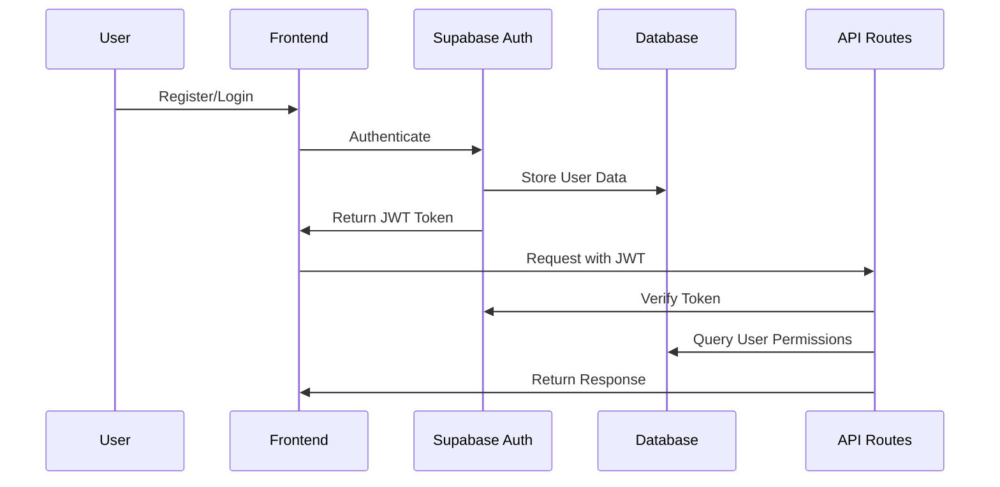

# Design Document

## Overview

This design focuses on cleaning up and reorganizing the existing authentication implementation to provide a seamless user journey. The system will leverage the already configured Supabase Auth with multiple OAuth providers (Google, Facebook, Twitter/X, LinkedIn, Azure, GitHub, Notion, Apple) plus magic link email authentication. The redesign emphasizes user experience optimization, code organization, and end-to-end functionality.

## Architecture

### High-Level Architecture



### Authentication Flow



## Components and Interfaces

### 1. Authentication Components

#### AuthProvider Component
- Wraps the application with Supabase auth context
- Manages authentication state globally
- Handles token refresh automatically

#### Login/Register Forms
- Email/password authentication
- OAuth provider buttons (Google, GitHub, LinkedIn)
- Form validation using react-hook-form and zod
- Error handling and loading states

#### Protected Route Wrapper
- Higher-order component for route protection
- Redirects unauthenticated users to login
- Supports role-based access control

### 2. API Key Management Components

#### API Key Dashboard
- Lists all user API keys with metadata
- Provides key generation interface
- Handles key revocation and management

#### API Key Generator Service
- Generates cryptographically secure API keys
- Associates keys with user accounts and permissions
- Implements rate limiting and tier restrictions

### 3. User Management Components

#### User Profile Management
- Profile editing interface
- Email verification flow
- Password change functionality

#### Admin Dashboard (Future Enhancement)
- User role management
- Usage analytics
- System administration tools

## Data Models

### User Profile Extension
```sql
CREATE TABLE user_profiles (
  id UUID REFERENCES auth.users(id) PRIMARY KEY,
  email TEXT NOT NULL,
  full_name TEXT,
  company_name TEXT,
  role TEXT DEFAULT 'free' CHECK (role IN ('free', 'basic', 'pro', 'enterprise', 'admin')),
  created_at TIMESTAMP WITH TIME ZONE DEFAULT NOW(),
  updated_at TIMESTAMP WITH TIME ZONE DEFAULT NOW()
);
```

### API Keys Table
```sql
CREATE TABLE api_keys (
  id UUID DEFAULT gen_random_uuid() PRIMARY KEY,
  user_id UUID REFERENCES auth.users(id) ON DELETE CASCADE,
  key_hash TEXT NOT NULL UNIQUE,
  key_prefix TEXT NOT NULL,
  name TEXT,
  permissions JSONB DEFAULT '{}',
  last_used_at TIMESTAMP WITH TIME ZONE,
  created_at TIMESTAMP WITH TIME ZONE DEFAULT NOW(),
  revoked_at TIMESTAMP WITH TIME ZONE,
  expires_at TIMESTAMP WITH TIME ZONE
);
```

### API Usage Tracking
```sql
CREATE TABLE api_usage (
  id UUID DEFAULT gen_random_uuid() PRIMARY KEY,
  api_key_id UUID REFERENCES api_keys(id) ON DELETE CASCADE,
  endpoint TEXT NOT NULL,
  method TEXT NOT NULL,
  status_code INTEGER,
  ip_address INET,
  user_agent TEXT,
  created_at TIMESTAMP WITH TIME ZONE DEFAULT NOW()
);
```

### User Sessions
```sql
CREATE TABLE user_sessions (
  id UUID DEFAULT gen_random_uuid() PRIMARY KEY,
  user_id UUID REFERENCES auth.users(id) ON DELETE CASCADE,
  session_token TEXT NOT NULL UNIQUE,
  ip_address INET,
  user_agent TEXT,
  created_at TIMESTAMP WITH TIME ZONE DEFAULT NOW(),
  expires_at TIMESTAMP WITH TIME ZONE NOT NULL,
  revoked_at TIMESTAMP WITH TIME ZONE
);
```

## Error Handling

### Authentication Errors
- Invalid credentials: Clear messaging with retry options
- Email verification required: Redirect to verification flow
- OAuth failures: Fallback to email authentication
- Session expiry: Automatic refresh with fallback to re-login

### API Key Errors
- Key generation limits: Display tier restrictions and upgrade options
- Invalid API key usage: Return 401 with clear error messages
- Rate limiting: Return 429 with retry-after headers
- Revoked keys: Immediate invalidation with audit logging

### Validation Errors
- Form validation: Real-time feedback with zod schemas
- Email format: Client and server-side validation
- Password strength: Progressive enhancement with requirements
- Profile updates: Optimistic updates with rollback on failure

## Testing Strategy

### Unit Tests
- Authentication utility functions
- API key generation and validation
- Form validation schemas
- Database query functions

### Integration Tests
- Complete authentication flows
- API key lifecycle management
- OAuth provider integration
- Database operations with transactions

### End-to-End Tests
- User registration and login flows
- API key generation and usage
- Profile management workflows
- Admin functionality (when implemented)

### Security Tests
- JWT token validation
- API key security and entropy
- SQL injection prevention
- Rate limiting effectiveness
- Session management security

## Security Considerations

### Authentication Security
- JWT tokens with short expiration (15 minutes)
- Refresh tokens with longer expiration (7 days)
- Secure HTTP-only cookies for token storage
- CSRF protection for state-changing operations

### API Key Security
- Cryptographically secure key generation (32 bytes, base64url encoded)
- Key hashing in database (never store plain text)
- Key prefixes for identification (sk_live_, sk_test_)
- Automatic key rotation recommendations

### Data Protection
- Row-level security (RLS) policies in Supabase
- Encrypted sensitive data at rest
- Audit logging for all security events
- IP-based access controls for admin functions

### Rate Limiting
- Per-user authentication attempt limits
- API key generation rate limits
- API usage rate limits by tier
- Progressive backoff for failed attempts

## Performance Considerations

### Caching Strategy
- User profile data caching (5 minutes)
- API key validation caching (1 hour)
- Role permissions caching (30 minutes)
- Session state caching in Redis (if needed)

### Database Optimization
- Indexes on frequently queried columns
- Connection pooling for API routes
- Query optimization for user lookups
- Pagination for large data sets

### Frontend Performance
- Lazy loading of dashboard components
- Optimistic updates for user actions
- Debounced form validation
- Efficient re-rendering with React patterns

## Deployment and Configuration

### Environment Variables
```
NEXT_PUBLIC_SUPABASE_URL=your-supabase-url
NEXT_PUBLIC_SUPABASE_ANON_KEY=your-anon-key
SUPABASE_SERVICE_ROLE_KEY=your-service-key
NEXTAUTH_SECRET=your-nextauth-secret
NEXTAUTH_URL=your-app-url
```

### Supabase Configuration
- OAuth providers already configured: Google, Facebook, Twitter/X, LinkedIn, Azure, GitHub, Notion, Apple
- Magic link email authentication enabled
- RLS policies for data security
- Database migrations for schema cleanup and optimization
- Edge functions for complex business logic (if needed)

### Next.js Configuration
- Middleware for route protection
- API routes for server-side operations
- Static export compatibility maintained
- Environment-specific configurations